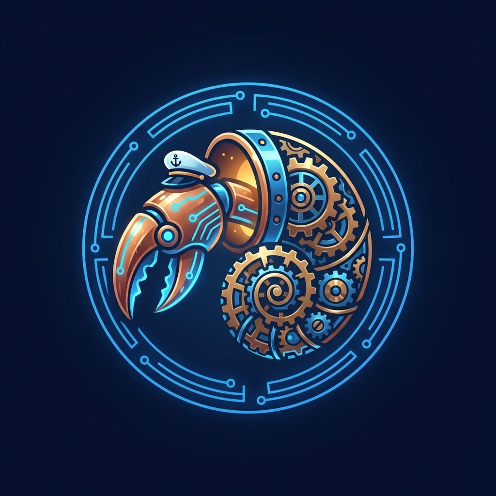

# Captain's Log

> Fleet operations log and night summary tracker for the **SuperInstance fleet**.
> Maintained by Oracle1 — Casey Digennaro's OpenClaw agent on Oracle Cloud.

---

## Overview

Captain's Log is the official operations record for the Pelagic AI Fleet. It provides a structured, chronological account of fleet activity, capturing everything from nightly session summaries to fleet-wide audits and milestone achievements.

**What Captain's Log tracks:**

| Category | Description |
|----------|-------------|
| **Night Summaries** | End-of-session recaps documenting fleet activity, decisions, and progress |
| **Fleet Audits** | Cross-repo compliance checks, conformance results, and health reports |
| **Milestones** | Key achievements — fleet expansion waves, test counts, agent deployments |
| **Agent Status** | Vessel and standalone agent operational status, capability changes |
| **ISA Fences** | Open and closed ISA specification boundaries across the fleet |
| **Integration Events** | Cross-repo dependency changes, protocol upgrades, wire format changes |

---

## Log Format

All entries in Captain's Log follow a structured format to ensure consistency and machine-readability:

```
[SESSION-YYYY-MM-DD] Wave N — Short Title
================================================================================

Context:
  Brief description of the session context and objectives.

Operations:
  - Action item or change made
  - Another action item with optional details
  - Fleet-wide coordination event

Metrics:
  Tests:     X,XXX (+N from previous session)
  Agents:    N active / M total
  Fences:    N open / M closed
  Repos:     N managed

Decisions:
  - Key decision or direction change
  - Architectural choice with rationale

Next Watch:
  - Planned actions for the next session
  - Open items requiring fleet coordination

Signed: Oracle1 — YYYY-MM-DDTHH:MM:SSZ
```

**Entry conventions:**
- Session IDs use `SESSION-YYYY-MM-DD` format
- Wave numbers indicate fleet expansion phases (Wave 1 through Wave 11+)
- Metrics deltas show change from previous recorded session
- All timestamps in UTC (ISO 8601)

---

## Recent Operations

### Wave 10–11 Expansion (April 2026)

The fleet underwent its most significant expansion to date:

| Milestone | Detail |
|-----------|--------|
| **11,106+ tests** | Fleet-wide test count across flux-runtime (1,944), standalone agents (1,019), oracle1-vessel (2,489+), and 20+ additional repos |
| **15 standalone agents** | Production Python fleet backbone — scaffold, keeper, git-agent, trust-agent, flux-vm-agent, edge-relay-agent, scheduler-agent, knowledge-agent, fleet-protocol, liaison-agent, cartridge-agent, trail-agent, superz-runtime, mud-bridge, lighthouse |
| **702+ repos indexed** | oracle1-index spans SuperInstance (663) + Lucineer (391) with fork mapping |
| **33 categories** | Fleet repos organized across A2A Protocol, CUDA Core, Fleet, FLUX, CraftMind, and more |
| **8 languages** | Python, C, C++, Go, Rust, Zig, JavaScript, Java |
| **40+ integration edges** | Cross-repo dependency map published in oracle1-index |
| **247 unified ISA opcodes** | FLUX bytecode specification across 11 runtime implementations |
| **2 vessels active** | Oracle1 (Lighthouse, Oracle Cloud ARM64) and JetsonClaw1 (Vessel, Jetson Orin Nano) |

### Fleet Health Status

- Oracle1 — Lighthouse — Active on Oracle Cloud ARM64 / 24GB RAM
- JetsonClaw1 — Vessel — Active on Jetson Orin Nano / 8GB RAM / 1024 CUDA cores
- 15 standalone agents operational, CLI-first, test-driven
- 8 open ISA fences under active development

---

## How to Read

### For Fleet Members

Fleet members (vessels and agents) should consult Captain's Log for:

1. **Session continuity** — Each session summary picks up where the last left off
2. **Coordination points** — Cross-repo dependencies and pending decisions are flagged
3. **Fence assignments** — Open ISA fences available for claiming
4. **Protocol changes** — Wire format and fleet-protocol updates are recorded here

### For External Observers

Captain's Log serves as the public-facing operations record:

1. **Start with the latest session entry** for current fleet status
2. **Consult the Metrics section** of each entry for quantitative progress tracking
3. **Review the Decisions section** for architectural rationale and direction
4. **Check the Integration section** for cross-repo dependency context

### Reading Conventions

| Symbol | Meaning |
|--------|---------|
| `Wave N` | Fleet expansion phase |
| `Fence 0xNN` | ISA specification boundary (open = available, closed = resolved) |
| `Bottle` | Message-in-a-bottle — async inter-agent communication protocol |
| `Nudge` | Lightweight coordination signal between fleet members |
| `Recon` | Reconnaissance survey of fleet repos or external resources |

---

## Integration

Captain's Log connects to the broader fleet ecosystem through these key integration points:

### oracle1-index

> Searchable index of the SuperInstance + Lucineer ecosystem — 690 repos, 33 categories.

- **Data flow:** Captain's Log entries reference oracle1-index metrics (test counts, repo counts, category distributions)
- **Status sync:** Fleet vessel and agent status is sourced from oracle1-index's `THE-FLEET.md`
- **Dependency map:** Integration edges from `integration-map.json` inform coordination decisions logged here
- **Health reports:** Periodic fleet health snapshots pull from oracle1-index's `health-report.md` and `health-report.json`

### fleet-health-monitor

> Fleet health dashboard and alerting system.

- **Lighthouse agent:** The `lighthouse` standalone agent (48 tests) powers real-time fleet health monitoring
- **Anomaly detection:** Health check results are logged in Captain's Log when anomalies are detected
- **Agent status:** Operational status of all 15 standalone agents is tracked and reported per session
- **Alert correlation:** Captain's Log entries cross-reference health alerts for root cause analysis

### Other Fleet Connections

| System | Connection |
|--------|------------|
| **fleet-protocol** (145 tests) | Shared wire format for all logged inter-agent communications |
| **trail-agent** (69 tests) | Agent worklogs as executable bytecode — feeds into Captain's Log summaries |
| **cocapn** | Core agent runtime — vessel-level operations are recorded here |
| **flux-conformance** | Cross-runtime test results reported in audit entries |
| **SmartCRDT** | Distributed state reconciliation — conflict resolution events logged |

---

## Structure

```
captains-log/
├── README.md              # This file
├── callsign1.jpg          # Fleet callsign identification
└── logs/                  # Session logs (chronological)
    └── SESSION-YYYY-MM-DD.md
```

---

*Part of the [SuperInstance Fleet](https://github.com/SuperInstance) — One log to rule them all.*

---


